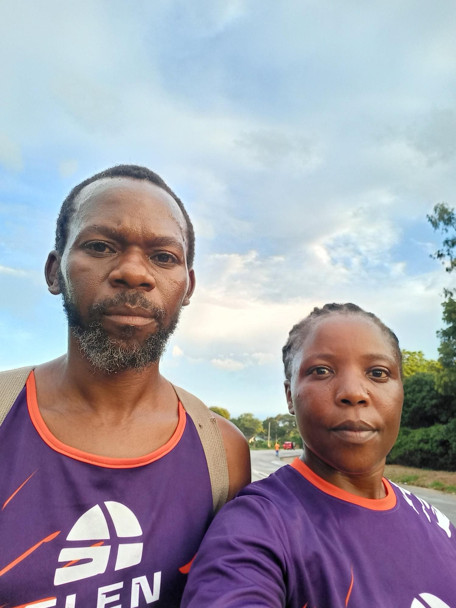
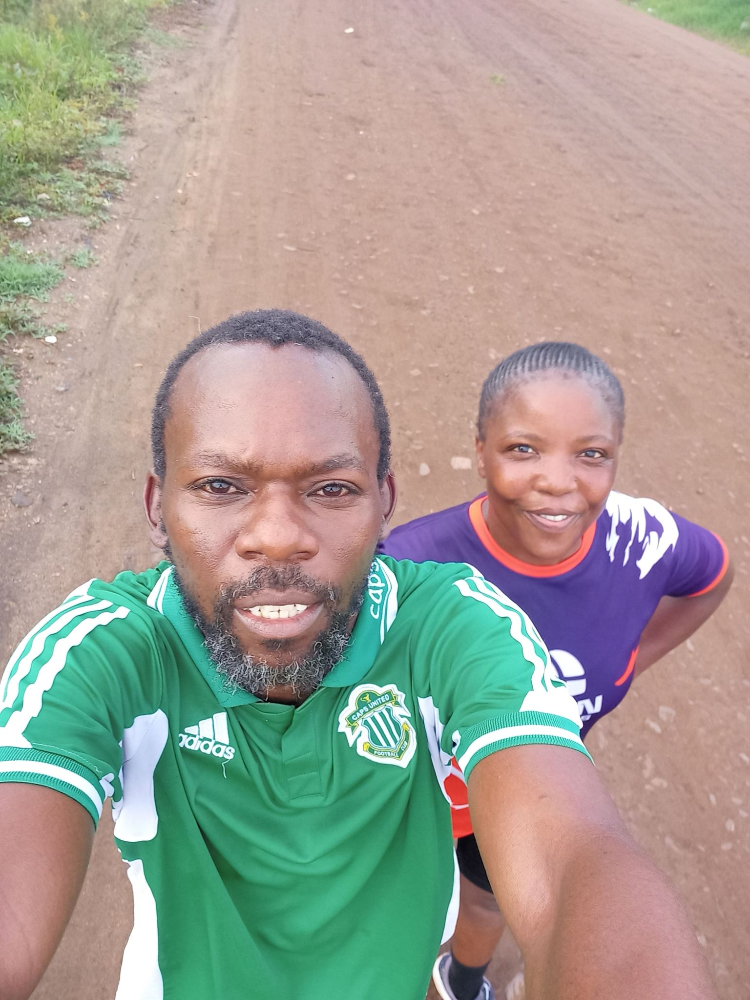
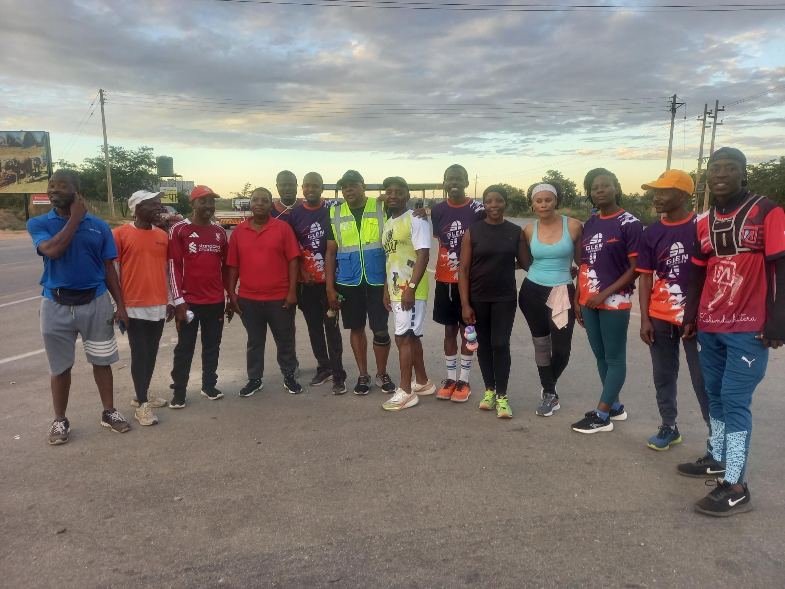
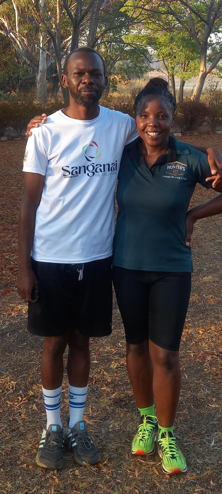

# And Then We Discovered Running

---

*By Humphrey and Linda*

Published on the [Humphrey and Linda's ](https://hbutau.github.io) blogs

---

There is a season in life that many people know but few talk about openly. Everything
feels heavy at once. The weight does not come from one place it comes from all
directions, quietly and persistently, until one day you realise you have stopped
believing that things can be different. That you can be different.

This is the story of how we found our way back. And how running, of all things, was
the path.

---

## Humphrey's Story

I was 37 when we started running. I want to say that plainly, because it matters to
the story.

Life had been throwing a great deal at us — the kind of accumulated pressure that does
not announce itself all at once but builds slowly until it becomes the background noise
of everything. Work was draining. Remote work had blurred the line between being at
the desk and never leaving it. I would sit for hours, deep in projects, and by the end
of each day I had very little left of myself. Not just physically, something deeper
was being worn away.

I was beginning to lose hope. Not in any single thing, but in a quieter, more
unsettling way. I was beginning to wonder whether I still had it in me. Whether the
best of what I could be and do was already behind me.

Then my boss said something offhand during a stand-up meeting. He mentioned that he
started every morning at 4:30am with a run. No gym, no coach — just him and the road
in the early dark. I went home and told Linda.

We decided to try.

### The Beginning

We had no gear, no plan, and no idea what we were doing. We picked landmarks and ran
to them. *"Let's go to OK Shops."* *"Let's turn back at the Telone Exchange."* That was
the extent of our training programme.

I wore gym shorts and a vest. Linda ran in a pair of jean shorts. We did not know
about running shoes, or warm-ups, or how to land your foot properly on the edge of a
tarmac road. I found that last one out the hard way — a twisted ankle, a lesson
learned.

When our friend Mildred later introduced us to a running app, we discovered we had
already been covering around 4.8 kilometres. That first 2.5km felt manageable. The
return leg was a different story entirely. It was a battle every time, and for a good
while Linda was ahead of me — pulling away while I worked just to keep up.

But I kept going. And something began to shift.

### The Moment Everything Changed

It was not a dramatic moment. There was no finish line, no medal, no audience.

It was just me, one ordinary morning, realising that I had run further than I had ever
run before. That my body — the same body I had never thought of as athletic, the body
of a man who had never been into fitness — had carried me there. And could carry me
further still.

That realisation did something to me that I had not expected. It was not just about
running. It was about everything. If I could do this — something I had never done, at
37, in the middle of one of the harder seasons of my life — then what else was possible?
The *"I can do it"* that running planted in me did not stay on the road. It followed me
home. Into work. Into the way I faced each day.

I began to believe in myself again.

### The Comments We Ignored

Not everyone was supportive. Some of the men in the neighbourhood would shout from the
roadside as we passed — mocking Linda about her weight, questioning why she was
exercising at all. It was unkind. Our answer was simple: earphones in, volume up, eyes
forward. We kept going until the comments stopped mattering.

### Finding Our People

Through a local running club's WhatsApp group, we eventually connected with two members
who ran in our own neighbourhood. They welcomed us and introduced us to what we now
call the *Trabablas route*. They joke to this day that they are the ones who brought us
to 10K running — though the truth is we were already there. We simply had not been
recording our runs.

It was with this pair that the idea of Glen Striders was first spoken aloud. Others
joined us. The club became real. And we have not stopped since.

### What Running Has Given Me

The COVID-19 lockdowns paused us, as they paused the world. But when the roads opened
again, we laced up and went back. Running had become too much a part of who we were to
leave behind.

The changes are real and they are lasting. I have shed considerable weight and
maintained it. I wake at 3:45am on weekdays without an alarm telling me to want to.
Linda tells me my posture has changed — the way I stand, the way I walk. She is
probably right.

But the most important change is the one that started it all. I came to running as
someone who was beginning to doubt himself. I stayed because running answered that
doubt with evidence, kilometre by kilometre, morning by morning.

I am stronger than I thought. That is what running taught me.

---

## Linda's Story

> *Linda — this is your space. Write in your own voice. What was life like for
> you during that heavy season? What made you want to run — or agree to try?
> What did those early mornings feel like from your side? What has running given
> you personally? There are no rules. Just your story, in your words, and I will
> shape it into the same style as Humphrey's section above.*

---

## A Word to Anyone Reading This

We are not coaches or athletes. We are two people who found
something that helped, and who want others to know that it is available to them too.

If life has been heavy lately, if you have been moving through your days carrying more
than feels manageable, if you have started to wonder whether you still have what it
takes we want to say this to you directly:

You are stronger than you think. Sometimes you just need a road and a reason to find
out.

You do not need the right shoes yet. You do not need a plan. Pick a landmark and run
to it. Then come back.

We promise, it gets easier. And so does everything else.

---

*— Humphrey and Linda*
*Glen Striders Zimbabwe*
[https://glenstriders.co.zw](https://glenstriders.co.zw)
