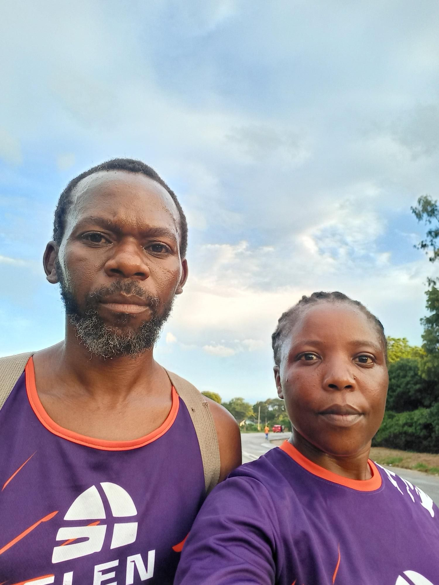
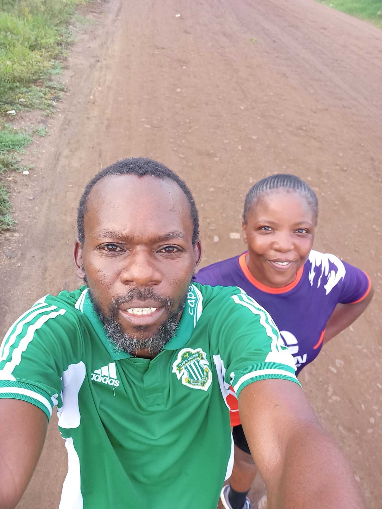
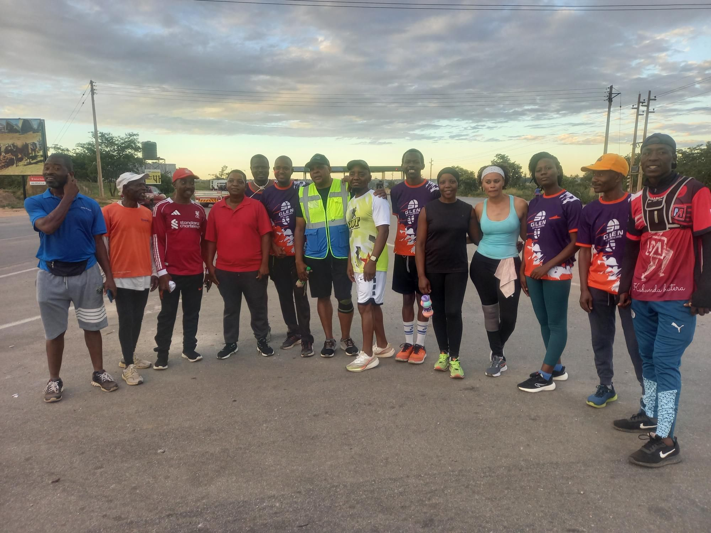
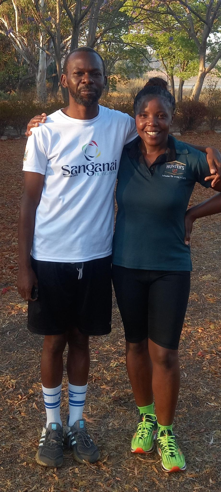

---

*By Humphrey and Linda*

---

There is a season in life that many people know but few talk about openly. Everything
feels heavy at once. The weight does not come from one place, it comes from all
directions, quietly and persistently, until one day you realise you have stopped
believing that things can be different. That you can be different.

This is the story of how we found our way back. And how running, of all things, was
the path.

---

## Humphrey's Story

I was 37 when we started running. I want to say that plainly, because it matters to
the story.

Life had been throwing a great deal at us, the kind of accumulated pressure that does
not announce itself all at once but builds slowly until it becomes the background noise
of everything. Work was draining. Remote work had blurred the line between being at
the desk and never leaving it. I would sit for hours, deep in a project, and by the end
of each day I had very little left of myself. Not just physically, something deeper
was being worn away.

I was beginning to lose hope. Not in any single thing, but in a quieter, more
unsettling way. I was beginning to wonder whether I still had it in me. Whether the
best of what I could be and do was already behind me.

Then my boss said something offhand during a stand-up meeting. He mentioned that he
started every morning at 4:30am with a run and how it helped him cope with work pressure and stress.
I went told Linda about it.

We decided to try.

### The Beginning

We had no gear, no plan, and no idea what we were doing. We picked landmarks and ran
to them. *"Let's go to OK Shops."* *"Let's turn back at the Telone Exchange buildings."* That was
the extent of our training programme.

I wore gym shorts and a vest. Linda ran in a pair of jean shorts. We did not know
about running shoes, or warm-ups, or how to land your foot properly on the edge of a
tarmac road. I found that last one out the hard way, a twisted ankle, a lesson
learned.

When our friend Mildred later introduced us to a running app, we discovered we had
already been covering around 4.8 kilometres. That first 2.5km felt manageable. The
return leg was a different story entirely. It was a battle every time, and for a good
while Linda was ahead of me — pulling away while I worked just to keep up.

But I kept going. And something began to shift.

### The Moment Everything Changed

It was not a dramatic moment. There was no finish line, no medal, no audience.

It was just me, one ordinary morning, realising that I had run further than I had ever
run before. That my body, the same body I had never thought of as athletic, the body
of a man who had never been into fitness had carried me there. And could carry me
further still.

That realisation did something to me that I had not expected. It was not just about
running. It was about everything. If I could do this — something I had never done, at
37, in the middle of one of the harder seasons of my life — then what else was possible?
The *"I can do it"* that running planted in me did not stay on the road. It followed me
home. Into work. Into the way I faced each day.

I began to believe in myself again.

### The Comments We Ignored

Not everyone was supportive. Some of the men in the neighbourhood would shout from the
roadside as we passed mocking Linda about her weight, questioning why she was
exercising at all. It was unkind. Our answer was simple: earphones in, volume up, eyes
forward. We kept going until the comments stopped mattering.

### Finding Our People

Through a local running club's WhatsApp group, we eventually connected with two members
who ran in our own neighbourhood. They welcomed us and introduced us to what we now
call the *Trabablas route*. They joke to this day that they are the ones who brought us
to 10K running — though the truth is we were already there. We simply had not been
recording our runs.

It was with this pair that the idea of Glen Striders was first spoken aloud. Others
joined us. The club became real. And we have not stopped since.

### What Running Has Given Me

The COVID-19 lockdowns paused us, as they paused the world. But when the roads opened
again, we laced up and went back. Running had become too much a part of who we were to
leave behind.

The changes are real and they are lasting. I have shed considerable weight and
maintained it. I wake at 3:45am on weekdays without an alarm telling me to want to.
Linda tells me my posture has changed the way I stand, the way I walk. She is
probably right.

But the most important change is the one that started it all. I came to running as
someone who was beginning to doubt himself. I stayed because running answered that
doubt with evidence, kilometre by kilometre, morning by morning.

I am stronger than I thought. That is what running taught me.

---

## Linda's Story

I was 35 when we started running. And I want to be honest, I did not join because
I was burning out. I joined because Humphrey was, and we do everything together.

But here is the thing: I had always wanted to run. I just had not found the reason
to start. When Humphrey came home and said his boss ran every morning, I did not
hesitate. *"Let's do it together,"* I said. Because that is how we are.

### The Gear We Did Not Have

I had no running shoes. What I had was a pair of fashion sneakers, the kind you
wear to look nice, not to cover kilometres. I had no shorts either, so I took a
pair of old jeans and cut them into a short right there. That was my kit.

I remember our first long run, all the way to Glen Norah, about 5 kilometres from
home. Somewhere along the way I decided I wanted to run barefoot. I took my shoes
off and ran on the tar.

It was painful. Immediately, obviously painful. I put them back on.

That run was horrible. But I did not stop.

### The Jealousy That Pushed Me

Before we started running, I used to watch our friend Mildred on Strava and on her
WhatsApp statuses. She would post pictures of herself after runs with her face dripping
with sweat, beaming. And I would feel something I can only describe as jealousy.
Not the bad kind. The kind that says: *I want that. I can do that. I can do better.*

And when we started running, I surprised myself. I was ahead of Humphrey. Faster,
stronger, at least in those early months. I felt powerful in a way I had not
expected. Running gave me that before it gave me anything else.

With time, Humphrey caught up and surpassed me. But those early mornings when I
was pulling ahead I still think about them.

### What They Said

The comments from the neighbourhood were something else. Humphrey has already told
you about the ones directed at me. But my favourite if you can call it that
was the man who looked at Humphrey and said, with complete seriousness:

*"You are training this wife of yours. One of these days she is going to beat you up."*

We laugh about it now.

There was also the man who told me I had no business running because I was too
skinny. I will leave out the exact words he used. But my answer was simple: I kept
running. I am still running.

We started going out at 4am — winter and summer, dark and cold — partly because
we loved the mornings, and partly to avoid the comments before the neighbourhood
woke up. Eventually we stopped caring. The road was ours either way.

### The Injuries I Ran Through

I fell. A lot. Along the neighbourhood main roads I fell about five times,  hands, elbows,
knees hitting the ground. I would get up and keep going. I stopped being embarrassed
about it. Falling was just part of the route.

It was Humphrey who eventually said: *"You will only stop falling when you do core
strength training."* We started doing core work before our runs. The falling stopped.

The more serious injury was shin splints. We had been running every single day —
10km, 12, sometimes 15 — without rest days, without enough recovery. My shins paid
the price. It took over a year to fully heal. I learned the hard way that rest is
not weakness. It is part of training.

I also used to have problems with my joints, something shifting out of place, a
weakness I could not quite explain. I fell because of it. Running, and the strength
that came with it, fixed what I had been living with for years without realising it
could be fixed.

### The 47 Kilometres

The run I am most proud of happened when we were celebrating Humphrey's 44th birthday.

We decided to run 44 kilometres for his 44 years. I was running alongside him, and
when we reached the 44th kilometre I paused my run — I felt I had done my part.
But the coach running with us from Fitness 22 was having none of it.

*"You are not stopping,"* he said.

So I kept going. Three more kilometres. Forty-seven in total.

I did not plan to run 47 kilometres that day. But I did.

### What Running Has Given Me

Running taught me something I carry into everything else now: *run your own race,
at your own pace, in your own time.* I do not compare myself to others on the road.
I show up, I move, I finish.

I am stronger than I have ever been, physically and in every other way. I wake
before 4am without an alarm. Discipline, endurance, and a quiet confidence have
become part of who I am.

But Glen Striders is here. The club we built together is still going. Every morning,
every kilometre. And that, too, is something we made together.

---

## A Word to Anyone Reading This

We are not coaches or athletes. We are two people who were struggling, who found
something that helped, and who want others to know that it is available to them too.

If life has been heavy lately if you have been moving through your days carrying more
than feels manageable, if you have started to wonder whether you still have what it
takes — we want to say this to you directly:

You are stronger than you think. Sometimes you just need a road and a reason to find
out.

You do not need the right shoes yet. You do not need a plan. Pick a landmark and run
to it. Then come back.

We promise, it gets easier. And so does everything else.

---

*— Humphrey and Linda*
*Glen Striders Zimbabwe*
[https://glenstriders.co.zw](https://glenstriders.co.zw)
