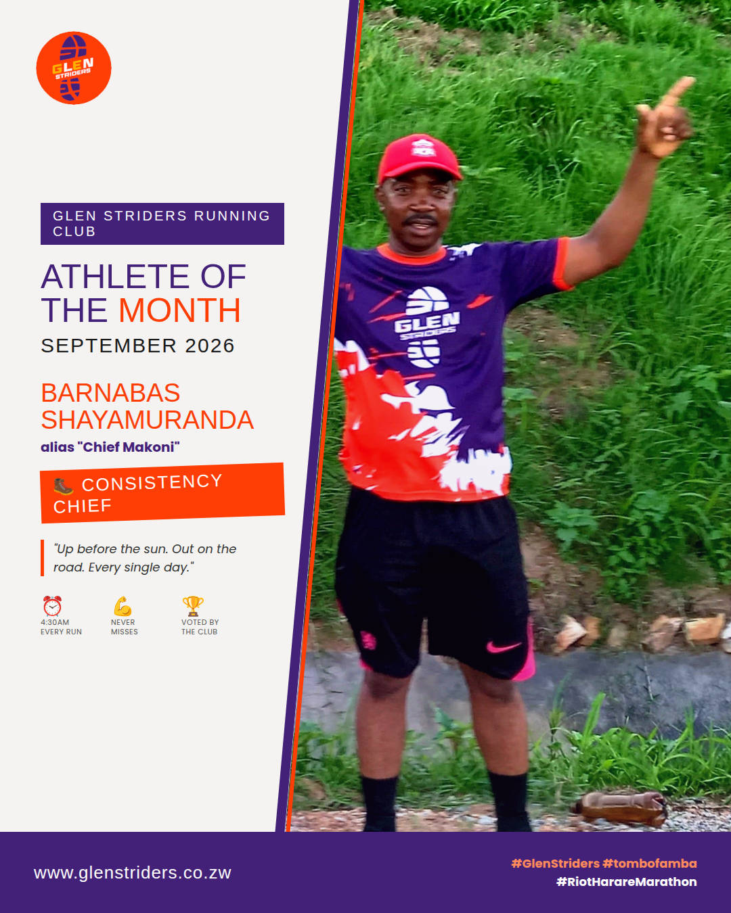

Glen Striders is proud to announce Chief Makoni as our Athlete of the Month for September! He was on fire all month, consistent in every weekly session and always finishing strong. What a month it's been for him.

When Linda and I first invited Barnabas to our running club, we did it simply as runners inviting a fellow runner to join his community. Looking at the runner he has become, we couldn't be prouder.

When he joined us, Chief was known for his steady, dependable pace, the kind of runner you could count on to hold a consistent rhythm at training. Back then, his average pace was around seven minutes per kilometer. Watching him build on that foundation has been one of the most rewarding parts of running alongside him.

That growth was on full display at the RIOT Rera Marathon 10km race, where Chief clocked an impressive 53 minutes. He flew through the first 5 kilometers at a 4-minute-per-kilometer pace before settling into the 5s for the remainder. There's nothing quite like watching a runner transform, and it never fails to bring a smile to our faces.

September is also Chief's birthday month. We had planned to hold his Athlete of the Month and birthday celebrations this weekend, but we've moved them to next week

Happy birthday and congratulations, Chief! Here's to many more months like this one, and many more years of running, health, and personal bests.

### Why We Have an Athlete of the Month

At Glen Striders, we believe running is about more than finishing times. It's about showing up, putting in the work, and growing together. The Athlete of the Month award exists to recognise the members who embody that spirit, whether through consistency, improvement, effort, or the way they lift up the people around them. Every member has a story, and this award is one way we celebrate it.

### Benefits of Taking Part

Recognition: Your effort is celebrated in front of the whole club and community.
Motivation: A monthly goal to work towards keeps training fresh and exciting.
Consistency: Showing up week after week is what the award rewards, and it's the best habit any runner can build.
Community: You become part of a club that cheers for every member, from first-timers to seasoned racers.
Inspiration: Your journey encourages other runners to keep going.

### Big News: Two Awards from October

From October onwards, we will be recognising two winners every month: Athlete of the Month (Female) and Athlete of the Month (Male). More recognition means more runners celebrated, and we can't wait to see who steps up.

### Partner With Us

We are looking for a sponsor for the Athlete of the Month awards. If you or your business would like to support a growing running community and put your brand in front of active, health-minded people, we would love to hear from you. Contact us at info@glenstriders.co.zw or phone: +263777216561 to discuss sponsorship.

### Run With Us

Whether you're just starting out or chasing a personal best, there's a place for you at Glen Striders. Join us for our next run: Everyday from Ok Makomva @4:45am. Come as you are and leave stronger.
