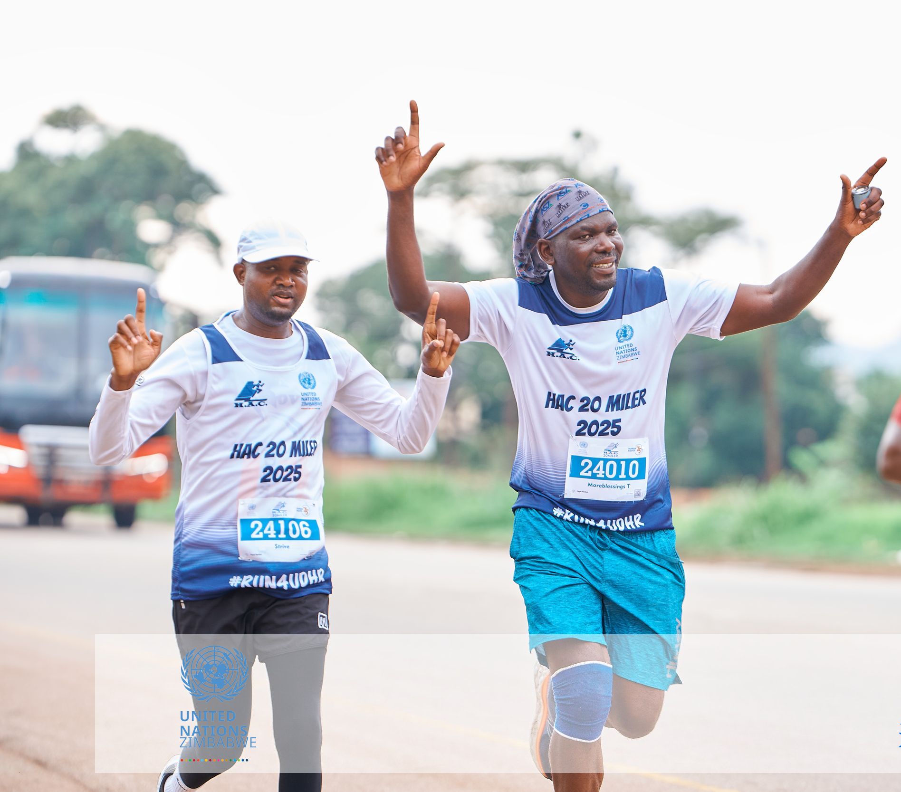

The HAC 20 Miler is one of Zimbabwe's oldest and most prestigious annual road races. Organized by the Harare Athletics Club, this iconic 32 km event features a challenging, hilly course that every runner in and around Zimbabwe should experience at least once.

Starting between the 11 km and 13 km pegs along Shamva Road, the point-to-point route climbs through a demanding +393 m elevation gain before finishing at the Old Georgians Sports Club in Groombridge, Harare. Whether you prefer to tackle the full distance solo or pair up for the relay option, it promises a memorable day on the road.

Beyond its prestige, the HAC 20 Miler serves as an essential training benchmark for long-distance runners targeting regional ultra-marathons like the Comrades Marathon and the Two Oceans Marathon. As the traditional grand finale on the Zimbabwean road running calendar, it is the ultimate test of endurance to cap off the year.

Conquering this course demands strong quads, a solid core, and unyielding mental resolve. With just 9 weeks to go until race day on December 6th, now is the time to dial in your preparation.

### Prepare with Glen Striders

You don't have to face this challenge alone. At Glen Striders Running Club, we are launching a focused training block tailored specifically for the HAC 20 Miler course. Our weekly schedule includes:

   -  Targeted Hill Repeats: To build the leg power needed to conquer Shamva Road's inclines.

   - Structured Speed & Strength Sessions: To improve running economy and guard against fatigue.

  -  Guided Long Slow Distance (LSD) Runs: Complete with pacing groups and supportive company to help you clock the miles.

Whether you are aiming for a personal best or taking on your first 32 km race, training alongside Glen Striders gives you the structure, accountability, and camaraderie you need to line up on December 6th fully prepared.

Ready to tackle the monster? Join Glen Striders for our upcoming weekend long run and start your HAC 20 Miler journey with us today!
